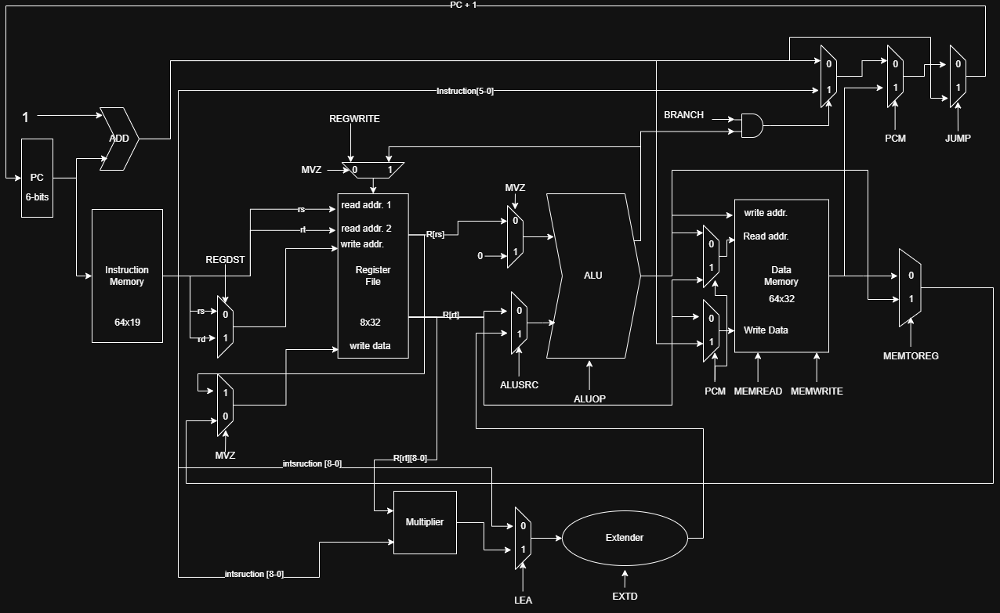

# 🧠 Single-Cycle MIPS Processor (VHDL Implementation)

This project implements a simplified **single-cycle MIPS processor** in **VHDL** that supports a selected subset of MIPS instructions along with **three custom instructions**: `lea`, `mvz`, and `pcm`.

The processor is follows a single-cycle execution model, where each instruction is fetched, decoded, executed, and completed within one clock cycle.

---
## Instruction Formats
| Format  | 4-bits | 3-bits | 3-bits | 3-bits       | 3-bits       | 3-bits |
|---------|--------|--------|--------|--------------|--------------|--------|
| I-type  | `op`   | `rs`   | `rt`   |               `immediate`            |
| J-type  | `op`   | —      |                    `address`                  |
| R-type  | `op`   | `rs`   | `rt`   | `rd`         |  —           | `func` |

## ✅ Supported Instruction Set

### 🔹 Arithmetic & Logic Instructions
| Instruction | Operation                          |
|-------------|-------------------------------------|
| `add`       | `R[rd] = R[rs] + R[rt]`            |
| `sub`       | `R[rd] = R[rs] - R[rt]`            |
| `and`       | `R[rd] = R[rs] & R[rt]`            |
| `or`        | `R[rd] = R[rs] | R[rt]`            |
| `addi`      | `R[rt] = R[rs] + Imm`              |
| `andi`      | `R[rt] = R[rs] & Imm`              |
| `slt`       | `R[rd] = (R[rs] < R[rt]) ? 1 : 0`   |

### 🔹 Memory Instructions
| Instruction | Operation                           |
|-------------|--------------------------------------|
| `lw`        | `R[rt] = Memory[R[rs] + offset]`    |
| `sw`        | `Memory[R[rs] + offset] = R[rt]`    |

### 🔹 Control Flow Instructions
| Instruction | Operation                          |
|-------------|-------------------------------------|
| `beq`       | `if (R[rs] == R[rt]) PC += offset` |
| `j`         | `PC = address`                     |

---

## 🧪 Custom Instruction Set

### 🔸 `lea rs, rt, K`
```mips
# R[rt] = K * LSB10(R[rt]) + R[rs]
# Description:
# Multiply the least significant 10 bits of register R[rt] by constant K,
# then add the result to the content of R[rs] and store the final value in R[rt].
```

### 🔸 `mvz rd, rs, rt`
```mips
# if (R[rt] == 0) R[rd] = R[rs]
# Description:
# Move the content of register R[rs] to R[rd] only if the value in R[rt] is zero.
```

### 🔸 `pcm (rt), offset(rs)`
```mips
# PC = Memory[R[rt]]
# Memory[R[rs] + offset] = PC + 4
# Description:
# Load the PC with the value stored in memory at address R[rt],
# then write PC + 4 to memory at address R[rs] + offset.
```
## Datapath Diagram

